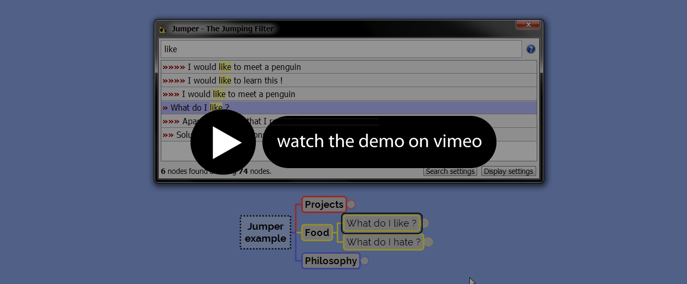

#  Jumper - the jumping filter for Freeplane

A search box that filters the nodes on-the-fly as the user types the search terms, and allows to jump to one of the results.

## Presentation

This Freeplane add-on provides an easy and quick way to search for nodes in Freeplane maps. Press Jumper shortcut, type some text snippets, and you will instantly see all the nodes (or branches !) that contain them in the Jumper window. Select one of these nodes to select it in the map.

> :bell: I will really appreciate any feedback. They will help to keep me motivated to improve or maintain the add-on.  
> Do you use it ? Just let me know :smile:. You can write to me in [this github thread](https://github.com/lilive/Freeplane-Jumper/issues/1) or in this [dedicated discussion](https://sourceforge.net/p/freeplane/discussion/758437/thread/e7b4594c02/) in the Freeplane forum.  
> Do you feel that something may be improved ? Have you found something that do not seems to work as expected ? Tell me !

> :bell: Jumper doesn't modify your maps, you can use it without fear of data loss.

## Main features

- Search results updated as you type
- Matching text is highlighted in the results list
- Regular search of transversal search (find words or text snippets across a branch)
- Words or text snippets can be searched in any order
- Search in any part of the nodes (core text, details, notes, attributes)
- Plain text or regular expressions search, case sensitive or insensitive
- Can focus the map view on the node selected in the results list
- Search the whole map, only the siblings of the selected node, or its descendants
- Search history
- Keyboard shortcuts for all the search options
- Persistent search settings
- Many options to customize the results appearence

## Usage

### Start Jumper

To start searching with Jumper, you usually run it with a keyboard shortcut. This is better because Jumper is designed to be used with the keyboard. The default keyboard shortcut is `Ctrl+Shift+J`. However, you can run Jumper with the menu `Edit > Find > Jumper`.

During the installation process, you can refuse to assign `Ctrl+Shift+J` to Jumper and choose another one.

### Search & jump

When the jumper dialog pop up, just start typing the text you're looking for. Select a node in the results list with the `Up` and `Down` keyboard arrows and press `Enter` to jump to this node.

Jumper has got many options that control where it searches, how it searches, and how it displays the results. Click the question mark icon to open the usage instructions.

## Installation

- Download `jumper-vX.X.X.addon.mm` from [the last release](https://github.com/lilive/Freeplane-Jumper/releases)
- Open this file with Freeplane and follow the instructions
- Jumper require some permissions to works. At menu `Tools > Preferences > Scripts`:

  - Set "script execution enabled" to Yes
  - Check "Permit file read operations"
  - Check "Permit file write operations"
  
  Jumper need the file permissions because it save its settings in the Freeplane user directory. The name of the file is `lilive_jumper.json`.  
  Jumper do not modify your maps, there is no risk to loose informations.
  
- The installer propose you to use the keyboard shortcut `Ctrl+Shift+J` to start Jumper. If you already use this shortcut for another thing, you are asked if you want to use it for Jumper. If you answer "no" you are asked for another shortcut you want instead.
- Restart Freeplane
- You can now use Jumper.

## TODO - Ideas

*Legend:  
`[ ]` = To do  
`[?]` = To do, but is it a good idea ?  
`[n]` = (n is a number) To do, lower number means higher priority*  
`[X]` = Done

---

`[ ]` Update code comments  
`[?]` Option to search entire words only, or only at the beginning of the words  
`[?]` Option to order results by level  
`[?]` Option to not search before N characters are typed  
`[?]` Jump to next result and jump to previous result without opening the dialog.  
`[?]` Don't buffer node content (The plain text for each node is buffered to speed up the search. Do we really need it?)  
`[?]` Allow to search only in nodes with the same style than the currently selected node. Or provide a style selector.

---

`[X]` Option to search in nodes hidden by Freeplane filter  
`[X]` Give the focus to the help window when it opens.  
`[X]` Option to not bring back the last search pattern after some time  
`[X]` Do not use the root node for transversal match
`[X]` Do the search in another thread to improve GUI reactivity  
`[X]` Option to center the map on the selected result as the results list is browsed with the arrow keys  
`[X]` Option to set the search string to the last one when the window open. Select this whole text in the text field, to make it be replaced as soon as the user type someting new.  

## Compilation from the sources

If you want to build the add-on installation file `jumper-vX.X.X.addon.mm` yourself, you have to build the library before to package the addon.

- Install Freeplane (of course !)
- Download the source
- Install gradle
- Open `build.gradle` with a text editor and modify the paths in `repositories.dirs[]` to point to your Freeplane installation
- Get a command prompt at the root of the sources folder
- `gradle build` will create the file lib/bookmarks.jar

Now you can open `jumper.mm` with Freeplane and package the addon with [Tools > Developer Tools > Package add-on for publication](https://freeplane.sourceforge.io/wiki/index.php/Add-ons_(Develop)). This will create the file `jumper-vX.X.X.addon.mm`. Open this file with Freeplane to install the add-on.

## Credits

- Thanks to Freeplane users who have given me feedbacks and support during the development (special mention to sfpcom for the add-on name :wink:)
- And of course many thanks to Freeplane developers !
